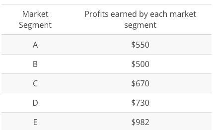

## Introduction
<iframe width="100%" height="315" src="https://www.youtube.com/embed/u3qLjP8KMKc" frameborder="0" allow="accelerometer; autoplay; clipboard-write; encrypted-media; gyroscope; picture-in-picture" allowfullscreen></iframe>

# Introducing Window Functions
<iframe width="100%" height="315" src="https://www.youtube.com/embed/gp0RPgkDHsQ" frameborder="0" allow="accelerometer; autoplay; clipboard-write; encrypted-media; gyroscope; picture-in-picture" allowfullscreen></iframe>

PostgreSQL’s documentation does an excellent job of [introducing the concept of Window Functions](https://www.postgresql.org/docs/9.1/static/tutorial-window.html): a window function performs a calculation across a set of table rows that are somehow related to the current row. This is comparable to the type of calculation that can be done with an aggregate function. But unlike regular aggregate functions, use of a window function does not cause rows to become grouped into a single output row — the rows retain their separate identities. Behind the scenes, the window function is able to access more than just the current row of the query result.

Through introducing window functions, we have also introduced two statements that you may not be familiar with: **OVER** and **PARTITION BY**. These are key to window functions. Not every window function uses **PARTITION BY**; we can also use **ORDER BY** or no statement at all depending on the query we want to run. You will practice using these clauses in the upcoming quizzes. If you want more details right now, [this resource](https://blog.sqlauthority.com/2015/11/04/sql-server-what-is-the-over-clause-notes-from-the-field-101/) from Pinal Dave is helpful.

>Note: You can’t use window functions and standard aggregations in the same query. More specifically, you can’t include window functions in a **GROUP BY** clause.

## Creating a Running Total Using Window Functions

Using Derek's previous video as an example, create another running total. This time, create a running total of `standard_amt_usd` (in the `orders` table) over order time with no date truncation. Your final table should have two columns: one with the amount being added for each new row, and a second with the running total.

```
  SELECT standard_amt_usd,
         SUM(standard_amt_usd) OVER (ORDER BY occurred_at) AS running_total
  FROM orders
```

## Creating a *Partitioned* Running Total Using Window Functions

Now, modify your query from the previous quiz to include partitions. Still create a running total of `standard_amt_usd` (in the `orders` table) over order time, but this time, date truncate `occurred_at` by year and partition by that same year-truncated `occurred_at` variable. Your final table should have three columns: One with the amount being added for each row, one for the truncated date, and a final column with the running total within each year.

```
  SELECT standard_amt_usd,
         DATE_TRUNC('year', occurred_at) as year,
         SUM(standard_amt_usd) OVER (PARTITION BY DATE_TRUNC('year', occurred_at) ORDER BY occurred_at) AS running_total
  FROM orders
```
If you'd like another example of partitioning, check out the top answer from this Stack Overflow post: [“Partition By” Keyword](https://stackoverflow.com/questions/561836/oracle-partition-by-keyword)

## ROW_NUMBER & RANK

<iframe width="100%" height="315" src="https://www.youtube.com/embed/rNJwmnzUTxg" frameborder="0" allow="accelerometer; autoplay; clipboard-write; encrypted-media; gyroscope; picture-in-picture" allowfullscreen></iframe>

## Ranking Total Paper Ordered by Account

Select the `id`, `account_id`, and `total` variable from the `orders` table, then create a column called `total_rank` that ranks this total amount of paper ordered (from highest to lowest) for each account using a partition. Your final table should have these four columns.

```
  SELECT id,
         account_id,
         total,
         RANK() OVER (PARTITION BY account_id ORDER BY total DESC) AS total_rank
  FROM orders
```

## Aggregates in Window Functions

<iframe width="100%" height="315" src="https://www.youtube.com/embed/Dxew5w3VF7k" frameborder="0" allow="accelerometer; autoplay; clipboard-write; encrypted-media; gyroscope; picture-in-picture" allowfullscreen></iframe>

## Aggregates in Window Functions with and without ORDER BY
Run the query that Derek wrote in the previous video in the first SQL Explorer below. Keep the query results in mind; you'll be comparing them to the results of another query next.

```
  SELECT id,
         account_id,
         standard_qty,
         DATE_TRUNC('month', occurred_at) AS month,
         DENSE_RANK() OVER (PARTITION BY account_id ORDER BY DATE_TRUNC('month',occurred_at)) AS dense_rank,
         SUM(standard_qty) OVER (PARTITION BY account_id ORDER BY DATE_TRUNC('month',occurred_at)) AS sum_std_qty,
         COUNT(standard_qty) OVER (PARTITION BY account_id ORDER BY DATE_TRUNC('month',occurred_at)) AS count_std_qty,
         AVG(standard_qty) OVER (PARTITION BY account_id ORDER BY DATE_TRUNC('month',occurred_at)) AS avg_std_qty,
         MIN(standard_qty) OVER (PARTITION BY account_id ORDER BY DATE_TRUNC('month',occurred_at)) AS min_std_qty,
         MAX(standard_qty) OVER (PARTITION BY account_id ORDER BY DATE_TRUNC('month',occurred_at)) AS max_std_qty
  FROM orders
```

Now remove `ORDER BY DATE_TRUNC('month',occurred_at`) in each line of the query that contains it in the SQL Explorer below. Evaluate your new query, compare it to the results in the SQL Explorer above, and answer the subsequent quiz questions.

```
  SELECT id,
         account_id,
         standard_qty,
         DATE_TRUNC('month', occurred_at) AS month,
         DENSE_RANK() OVER (PARTITION BY account_id ORDER BY DATE_TRUNC('month',occurred_at)) AS dense_rank,
         SUM(standard_qty) OVER (PARTITION BY account_id ORDER BY DATE_TRUNC('month',occurred_at)) AS sum_std_qty,
         COUNT(standard_qty) OVER (PARTITION BY account_id ORDER BY DATE_TRUNC('month',occurred_at)) AS count_std_qty,
         AVG(standard_qty) OVER (PARTITION BY account_id ORDER BY DATE_TRUNC('month',occurred_at)) AS avg_std_qty,
         MIN(standard_qty) OVER (PARTITION BY account_id ORDER BY DATE_TRUNC('month',occurred_at)) AS min_std_qty,
         MAX(standard_qty) OVER (PARTITION BY account_id ORDER BY DATE_TRUNC('month',occurred_at)) AS max_std_qty
  FROM orders
```

## Aggregates in Window Functions with and without ORDER BY
The `ORDER BY` clause is one of two clauses integral to window functions. The `ORDER` and `PARTITION` define what is referred to as the “window”—the ordered subset of data over which calculations are made. Removing `ORDER BY` just leaves an unordered partition; in our query's case, each column's value is simply an aggregation (e.g., sum, count, average, minimum, or maximum) of all the `standard_qty` values in its respective `account_id`.

As Stack Overflow user mathguy [explains](https://stackoverflow.com/questions/41364665/analytic-count-over-partition-with-and-without-order-by-clause):

The easiest way to think about this - leaving the `ORDER BY` out is equivalent to "ordering" in a way that all rows in the partition are "equal" to each other. Indeed, you can get the same effect by explicitly adding the `ORDER BY` clause like this: `ORDER BY 0` (or "order by" any constant expression), or even, more emphatically, `ORDER BY NULL`.

## Aliases for Multiple Window Functions

<iframe width="100%" height="315" src="https://www.youtube.com/embed/RWe03bULYnM" frameborder="0" allow="accelerometer; autoplay; clipboard-write; encrypted-media; gyroscope; picture-in-picture" allowfullscreen></iframe>

You can check out a complete list of window functions in Postgres (the syntax Mode uses) in the [Postgres documentation](https://www.postgresql.org/docs/8.4/static/functions-window.html).

## Shorten Your Window Function Queries by Aliasing

Now, create and use an alias to shorten the following query (which is different than the one in Derek's previous video) that has multiple window functions. Name the alias `account_year_window`, which is more descriptive than `main_window` in the example above.

```
  SELECT id,
         account_id,
         DATE_TRUNC('year',occurred_at) AS year,
         DENSE_RANK() OVER (PARTITION BY account_id ORDER BY DATE_TRUNC('year',occurred_at)) AS dense_rank,
         total_amt_usd,
         SUM(total_amt_usd) OVER (PARTITION BY account_id ORDER BY DATE_TRUNC('year',occurred_at)) AS sum_total_amt_usd,
         COUNT(total_amt_usd) OVER (PARTITION BY account_id ORDER BY DATE_TRUNC('year',occurred_at)) AS count_total_amt_usd,
         AVG(total_amt_usd) OVER (PARTITION BY account_id ORDER BY DATE_TRUNC('year',occurred_at)) AS avg_total_amt_usd,
         MIN(total_amt_usd) OVER (PARTITION BY account_id ORDER BY DATE_TRUNC('year',occurred_at)) AS min_total_amt_usd,
         MAX(total_amt_usd) OVER (PARTITION BY account_id ORDER BY DATE_TRUNC('year',occurred_at)) AS max_total_amt_usd
  FROM orders
```

## Aliases for Multiple Window Functions

```
  SELECT id,
         account_id,
         DATE_TRUNC('year',occurred_at) AS year,
         DENSE_RANK() OVER account_year_window AS dense_rank,
         total_amt_usd,
         SUM(total_amt_usd) OVER account_year_window AS sum_total_amt_usd,
         COUNT(total_amt_usd) OVER account_year_window AS count_total_amt_usd,
         AVG(total_amt_usd) OVER account_year_window AS avg_total_amt_usd,
         MIN(total_amt_usd) OVER account_year_window AS min_total_amt_usd,
         MAX(total_amt_usd) OVER account_year_window AS max_total_amt_usd
  FROM orders
  WINDOW account_year_window AS (PARTITION BY account_id ORDER BY DATE_TRUNC('year',occurred_at))
```
## Comparing a Row to Previous Row

<iframe width="100%" height="315" src="https://www.youtube.com/embed/Z_x5ZJyDZog" frameborder="0" allow="accelerometer; autoplay; clipboard-write; encrypted-media; gyroscope; picture-in-picture" allowfullscreen></iframe>

**Instructor Notes**

Let’s look at this again. We have broken down the syntax to explain LAG and LEAD functions separately.

## LAG function
**Purpose**
It returns the value from a previous row to the current row in the table.

**Step 1:**
Let’s first look at the **inner query** and see what this creates.

```
  SELECT     account_id, SUM(standard_qty) AS standard_sum
  FROM       orders
  GROUP BY   1
```

**What you see after running this SQL code:**

1. The query sums the standard_qty amounts for each account_id to give the standard paper each account has purchased over all time. E.g., account_id 2951 has purchased 8181 units of standard paper.

2. Notice that the results are not ordered by account_id or standard_qty.


**Step 2:**
We start building the **outer query**, and name the inner query as sub.

```
  SELECT account_id, standard_sum   
  FROM   (
          SELECT   account_id, SUM(standard_qty) AS standard_sum
          FROM     orders
          GROUP BY 1
         ) sub
```

This still returns the same table you see above, which is also shown below.


**Step 3 (Part A):**
We add the Window Function OVER `(ORDER BY standard_sum)` in the outer query that will create a result set in ascending order based on the standard_sum column.

```
  SELECT account_id,
         standard_sum,
         LAG(standard_sum) OVER (ORDER BY standard_sum) AS lag
  FROM   (
          SELECT   account_id, SUM(standard_qty) AS standard_sum
          FROM     orders
          GROUP BY 1
         ) sub
```       

This ordered column will set us up for the other part of the Window Function (see below).

**Step 3 (Part B):**
The `LAG` function creates a new column called *lag* as part of the outer query: `LAG(standard_sum) OVER (ORDER BY standard_sum) AS lag`. This new column named lag uses the values from the ordered *standard_sum* (Part A within Step 3).

```
  SELECT account_id,
         standard_sum,
         LAG(standard_sum) OVER (ORDER BY standard_sum) AS lag
  FROM   (
          SELECT   account_id,
                   SUM(standard_qty) AS standard_sum
          FROM     demo.orders
          GROUP BY 1
         ) sub
```

Each row’s value in *lag* is pulled from the previous row. E.g., for account_id 1901, the value in *lag* will come from the previous row. However, since there is no previous row to pull from, the value in *lag* for account_id 1901 will be NULL. For account_id 3371, the value in *lag* will be pulled from the previous row (i.e., account_id 1901), which will be 0. This goes on for each row in the table.

**What you see after running this SQL code:**


**Step 4:**
To compare the values between the rows, we need to use both columns (standard_sum and lag). We add a new column named `lag_difference`, which subtracts the lag value from the value in standard_sum for each row in the table:
`standard_sum - LAG(standard_sum) OVER (ORDER BY standard_sum) AS lag_difference`

```
  SELECT account_id,
         standard_sum,
         LAG(standard_sum) OVER (ORDER BY standard_sum) AS lag,
         standard_sum - LAG(standard_sum) OVER (ORDER BY standard_sum) AS lag_difference
  FROM (
         SELECT account_id,
         SUM(standard_qty) AS standard_sum
         FROM orders
         GROUP BY 1
        ) sub
```      
Each value in *lag_difference* is comparing the row values between the 2 columns (*standard_sum and lag*). E.g., since the value for *lag* in the case of account_id 1901 is NULL, the value in *lag_difference* for account_id 1901 will be NULL. However, for account_id 3371, the value in *lag_difference* will compare the value 79 (*standard_sum* for account_id 3371) with 0 (lag for account_id 3371) resulting in 79. This goes on for each row in the table.

**What you see after running this SQL code:**


**Now let’s look at the LEAD function.**

LEAD function
**Purpose:**
Return the value from the row following the current row in the table.

**Step 1:**
Let’s first look at the **inner query** and see what this creates.

```
  SELECT     account_id,
             SUM(standard_qty) AS standard_sum
  FROM       demo.orders
  GROUP BY   1
```
**What you see after running this SQL code:**

1. The query sums the standard_qty amounts for each account_id to give the standard paper each account has purchased over all time. E.g., account_id 2951 has purchased 8181 units of standard paper.
2. Notice that the results are not ordered by account_id or standard_qty.


**Step 2:**

We start building the **outer query**, and name the inner query as `sub`.
```
  SELECT account_id,
         standard_sum   
  FROM   (
          SELECT   account_id,
                   SUM(standard_qty) AS standard_sum
          FROM     demo.orders
          GROUP BY 1
         ) sub
```       
This will produce the same table as above, but sets us up for the next part.


**Step 3 (Part A):**
We add the Window Function `(OVER BY standard_sum)` in the outer query that will create a result set ordered in ascending order of the *standard_sum* column.

```
  SELECT account_id,
         standard_sum,
         LEAD(standard_sum) OVER (ORDER BY standard_sum) AS lead
  FROM   (
          SELECT   account_id,
                   SUM(standard_qty) AS standard_sum
          FROM     demo.orders
          GROUP BY 1
         ) sub
```

This ordered column will set us up for the other part of the Window Function (see below).

**Step 3 (Part B):**
The `LEAD` function in the Window Function statement creates a new column called lead as part of the outer query: `LEAD(standard_sum) OVER (ORDER BY standard_sum) AS lead`

This new column named *lead* uses the values from *standard_sum* (in the ordered table from Step 3 (Part A)). Each row’s value in lead is pulled from the row after it. E.g., for account_id 1901, the value in *lead* will come from the row following it (i.e., for account_id 3371). Since the value is 79, the value in *lead* for account_id 1901 will be 79. For account_id 3371, the value in *lead* will be pulled from the following row (i.e., account_id 1961), which will be 102. This goes on for each row in the table.

```
  SELECT account_id,
         standard_sum,
         LEAD(standard_sum) OVER (ORDER BY standard_sum) AS lead
  FROM   (
          SELECT   account_id,
                   SUM(standard_qty) AS standard_sum
          FROM     demo.orders
          GROUP BY 1
         ) sub
```       
**What you see after running this SQL code:**


**Step 4:**
To compare the values between the rows, we need to use both columns *(standard_sum and lag)*. We add a column named *lead_difference*, which subtracts the value in *standard_sum* from *lead* for each row in the table: `LEAD(standard_sum) OVER (ORDER BY standard_sum) - standard_sum AS lead_difference`

```
  SELECT account_id,
         standard_sum,
         LEAD(standard_sum) OVER (ORDER BY standard_sum) AS lead,
         LEAD(standard_sum) OVER (ORDER BY standard_sum) - standard_sum AS lead_difference
  FROM (
  SELECT account_id,
         SUM(standard_qty) AS standard_sum
         FROM orders
         GROUP BY 1
         ) sub
```
Each value in `lead_difference` is comparing the row values between the 2 columns (standard_sum and lead). E.g., for account_id 1901, the value in `lead_difference` will compare the value 0 (`standard_sum` for account_id 1901) with 79 (`lead` for account_id 1901) resulting in 79. This goes on for each row in the table.

**What you see after running this SQL code:**


## Scenarios for using LAG and LEAD functions

You can use LAG and LEAD functions whenever you are trying to compare the values in adjacent rows or rows that are offset by a certain number.

*Example 1:* You have a sales dataset with the following data and need to compare how the market segments fare against each other on profits earned.



*Example 2:* You have an inventory dataset with the following data and need to compare the number of days elapsed between each subsequent order placed for Item A.


As you can see, these are useful data analysis tools that you can use for more complex analysis!

## Comparing a Row to Previous Row

In the previous video, Derek outlines how to compare a row to a previous or subsequent row. This technique can be useful when analyzing time-based events. Imagine you're an analyst at Parch & Posey and you want to determine how the current order's total revenue ("total" meaning from sales of all types of paper) compares to the next order's total revenue.

Modify Derek's query from the previous video in the SQL Explorer below to perform this analysis. You'll need to use `occurred_at` and `total_amt_usd` in the `orders` table along with `LEAD` to do so. In your query results, there should be four columns: `occurred_at`, `total_amt_usd`, `lead`, and `lead_difference`.

```
  SELECT account_id,
         standard_sum,
         LAG(standard_sum) OVER (ORDER BY standard_sum) AS lag,
         LEAD(standard_sum) OVER (ORDER BY standard_sum) AS lead,
         standard_sum - LAG(standard_sum) OVER (ORDER BY standard_sum) AS lag_difference,
         LEAD(standard_sum) OVER (ORDER BY standard_sum) - standard_sum AS lead_difference
  FROM (
  SELECT account_id,
         SUM(standard_qty) AS standard_sum
    FROM orders
   GROUP BY 1
   ) sub
```

Solution:

```
  SELECT occurred_at,
         total_amt_usd,
         LEAD(total_amt_usd) OVER (ORDER BY occurred_at) AS lead,
         LEAD(total_amt_usd) OVER (ORDER BY occurred_at) - total_amt_usd AS lead_difference
  FROM (
  SELECT occurred_at,
         SUM(total_amt_usd) AS total_amt_usd
    FROM orders
   GROUP BY 1
  ) sub
```

## Introduction to Percentiles

<iframe width="100%" height="315" src="https://www.youtube.com/embed/t7SX2ZEdxKA" frameborder="0" allow="accelerometer; autoplay; clipboard-write; encrypted-media; gyroscope; picture-in-picture" allowfullscreen></iframe>

## Percentiles

<iframe width="100%" height="315" src="https://www.youtube.com/embed/Qro8uvysnys" frameborder="0" allow="accelerometer; autoplay; clipboard-write; encrypted-media; gyroscope; picture-in-picture" allowfullscreen></iframe>

You can use window functions to identify what percentile (or quartile, or any other subdivision) a given row falls into. The syntax is NTILE(*# of buckets*). In this case, ORDER BY determines which column to use to determine the quartiles (or whatever number of ‘tiles you specify).

**Expert Tip**
In cases with relatively few rows in a window, the `NTILE` function doesn’t calculate exactly as you might expect. For example, If you only had two records and you were measuring percentiles, you’d expect one record to define the 1st percentile, and the other record to define the 100th percentile. Using the `NTILE` function, what you’d actually see is one record in the 1st percentile, and one in the 2nd percentile.

In other words, when you use a NTILE function but the number of rows in the partition is less than the NTILE(number of groups), then NTILE will divide the rows into as many groups as there are members (rows) in the set but then stop short of the requested number of groups. If you’re working with very small windows, keep this in mind and consider using quartiles or similarly small bands.

You can check out a complete list of window functions in Postgres (the syntax Mode uses) in the [Postgres documentation](https://www.postgresql.org/docs/8.4/static/functions-window.html).

## Percentiles with Partitions
You can use partitions with percentiles to determine the percentile of a specific subset of all rows. Imagine you're an analyst at Parch & Posey and you want to determine the largest orders (in terms of quantity) a specific customer has made to encourage them to order more similarly sized large orders. You only want to consider the `NTILE` for that customer's `account_id`.

In the SQL Explorer below, write three queries (separately) that reflect each of the following:

1. Use the `NTILE` functionality to divide the accounts into 4 levels in terms of the amount of `standard_qty` for their orders. Your resulting table should have the `account_id`, the `occurred_at` time for each order, the total amount of `standard_qty` paper purchased, and one of four levels in a `standard_quartile` column.


2. Use the `NTILE` functionality to divide the accounts into two levels in terms of the amount of `gloss_qty` for their orders. Your resulting table should have the `account_id`, the `occurred_at` time for each order, the total amount of `gloss_qty` paper purchased, and one of two levels in a `gloss_half` column.


3. Use the `NTILE` functionality to divide the orders for each account into 100 levels in terms of the amount of `total_amt_usd` for their orders. Your resulting table should have the `account_id`, the `occurred_at` time for each order, the total amount of `total_amt_usd` paper purchased, and one of 100 levels in a `total_percentile` column.


**Note:** To make it easier to interpret the results, order by the account_id in each of the queries.

**Solutions**

1.
```
  SELECT
         account_id,
         occurred_at,
         standard_qty,
         NTILE(4) OVER (PARTITION BY account_id ORDER BY standard_qty) AS standard_quartile
    FROM orders
   ORDER BY account_id DESC
```
2.
```
  SELECT
         account_id,
         occurred_at,
         gloss_qty,
         NTILE(2) OVER (PARTITION BY account_id ORDER BY gloss_qty) AS gloss_half
    FROM orders
   ORDER BY account_id DESC
```
3.
```
  SELECT
         account_id,
         occurred_at,
         total_amt_usd,
         NTILE(100) OVER (PARTITION BY account_id ORDER BY total_amt_usd) AS total_percentile
    FROM orders
   ORDER BY account_id DESC
 ```

### RECAP

 <iframe width="100%" height="315" src="https://www.youtube.com/embed/2ZdocDMw7D8" frameborder="0" allow="accelerometer; autoplay; clipboard-write; encrypted-media; gyroscope; picture-in-picture" allowfullscreen></iframe>
